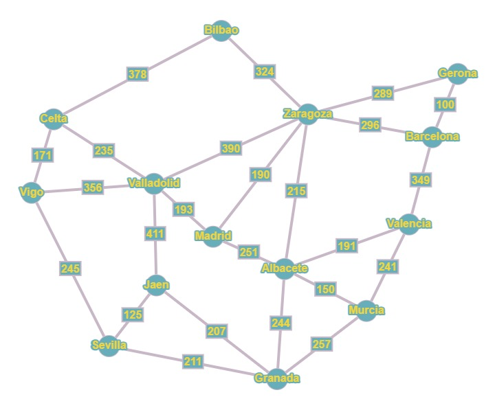

# Tarea 4
Resolución del agente viajero con el algoritmo genético 

## Participantes 
Rodrigo Alonso Páez Gastélum

Adrián Jaret Rendón Ríos 

## Objetivo de la actividad 

Implementar el algoritmo genético para la resolución del problema del agente viajero

### Especificación del código

- Primero se define una lista donde estarán las ciudades, un diccionario donde se determinan los costos en base al siguiente grafo 

  

- Se crea la matriz de las ciudades de tal forma que se recorre para ingresar las ciudades con sus distancias 

- Se saca los costos de las distancias entre ciudades y la fitness

- Se definen las funciones de operador genético, el cruce y mutación 

- Se define el algoritmo genético y "elitismo" para que seleccione los genes más aptos" 

- Se imprime el resultado
